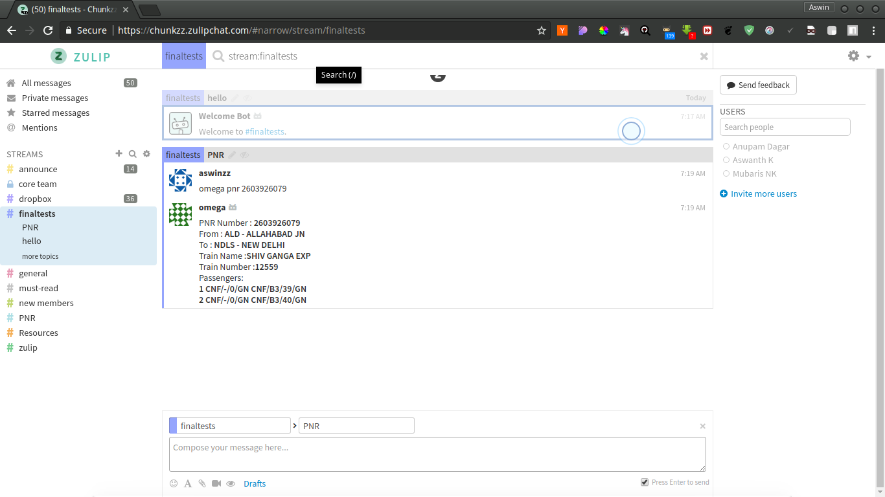
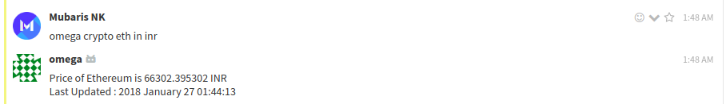
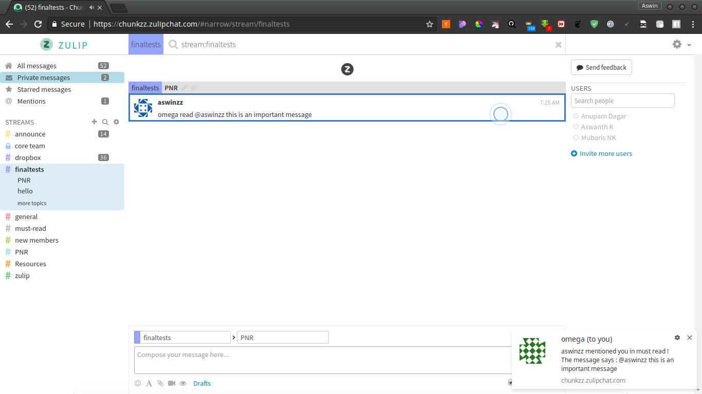
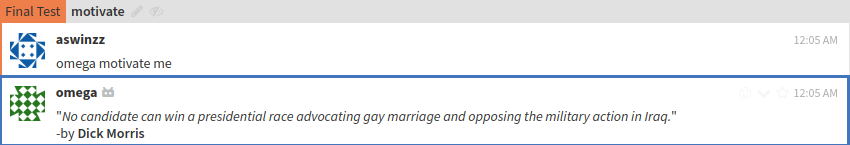
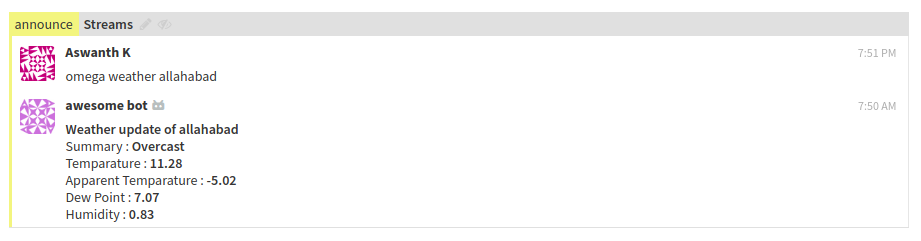
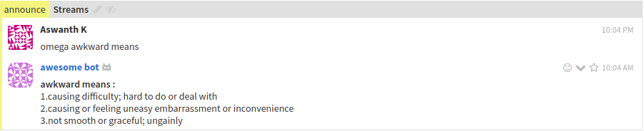

# Welcome to Omega-Bot!
## Team Chunkzz

**Omega-Bot**  is a zulip chatbot   


# Features

Omega-Bot can :
>
>* Check PNR status
>* Check Crypto Currency
>* Must-read functionality for channels
>*  Motivates you with quotes
>* Send mails via zulipchat
>* Shorten URL's
>* Shows weather
>* Use Gif while chatting :wink:

## How to use?

###  PNR Status :
Easy way to check you PNR status without going to other sites.  
<br>
`omega pnr "pnr number"` 
<br> 




###  Crypto Currency :
`leave command here"`  
  


###  Must Read :  
when we are in a group chat and if we want someone who is not online now to read some important message Must Read will be usefull. what it does is the bot will leave the important message as a private message automatically.  
`omega read @username "message"`  
  


###  Motivate:
Motivate is here to help you with motivational quotes when you are down :smile:  
```omega motivate```  
  

###  Mail:
Send mails while you chat :wink:  
`leave command here"`  
  

###  URL Shortner:
```omega shortenurl <url>```  
  

###  Weather:
This integration will help you to know the weather of any place you type.     
`omega weather <place>`  


###  Dictionary:
This integration is like a typical dictionary.The source of the dictionary is Oxford so the answers are more reliable and correct.      
`omega <word> means`  


###  Gif Chat :
`leave command here"`  
  

## Contributors
* [Mubaris NK](https://github.com/mubaris)  
* [Anupam Dagar](https://github.com/Anupam-Dagar)  
* [Aswin VB](https://github.com/aswinzz)  
* [Aswanth Koleri](https://github.com/aswanthkoleri)    
