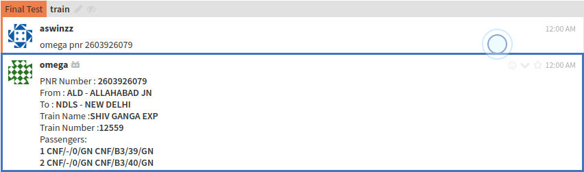
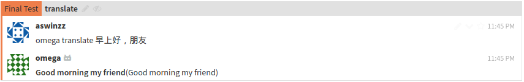
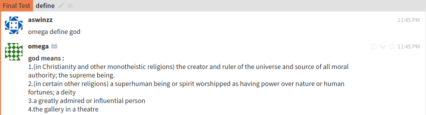
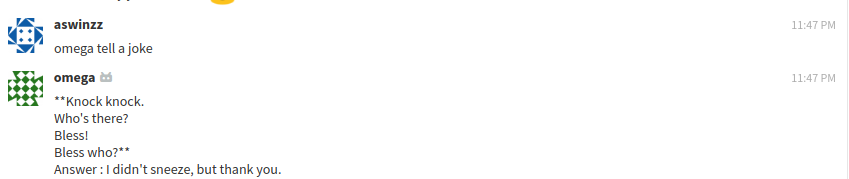
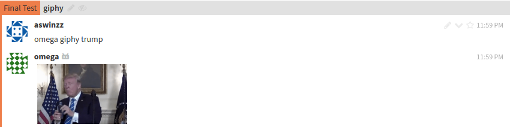
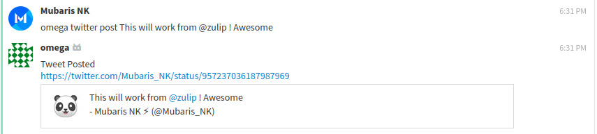
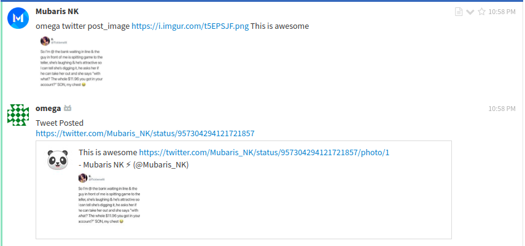
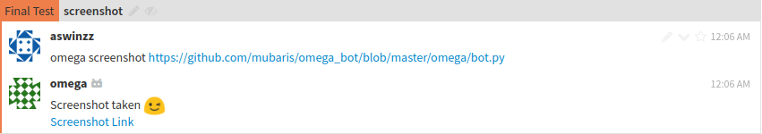

# Welcome to Omega-Bot!
## Team Chunkzz

**Omega-Bot**  is a zulip chatbot   


# Features

Omega-Bot can :
>
>* Translate any language
>* Post tweets
>* Search word meanings
>* Get top news from HackerNews
>* Check PNR status
>* Take Screenshots
>* Check Crypto Currency
>* Must-read functionality for channels
>* Crack a joke
>* Motivates you with quotes
>* Shorten URL's
>* Shows weather
>* Use Gif while chatting :wink:
>* Create Polls

## How to use?

###  PNR Status :
Easy way to check you PNR status without going to other sites.  

`omega pnr "pnr number"` 
 




###  Crypto Currency :

`omega crypto bhc in inr` or `omega crypto neo`  

  

###  Translate:

`omega translate "any language"` 

  

###  HackerNews:

`omega HN`  

  


###  Must Read :  
when we are in a group chat and if we want someone who is not online now to read some important message Must Read will be usefull. what it does is the bot will leave the important message as a private message automatically.  

`omega mustread @username "message"`  

  


###  Motivate:
Motivate is here to help you with motivational quotes when you are down :smile:  

```omega motivate```  

  

###  URL Shortner:

```omega shortenurl <url>```  

  

###  Weather:
This integration will help you to know the weather of any place you type.   

`omega weather <place>`  


###  Dictionary:
This integration is like a typical dictionary.The source of the dictionary is Oxford so the answers are more reliable and correct.      

`omega define "word"`  



###  Joke:
This integration cracks some really good as well as lame jokes !. 

`omega tell a joke`  



###  Gif Chat :

`omega giphy "keyword"`  

  

###  Twitter :

`omega twitter post "content"` or `omega twitter post_image "image url" "content"`  



###  Poll :
`omega poll create "Number of options" question "place the question here" option "place the options"`
`omega poll show "id"`
`omega poll show all`
`omega poll vote "id" "option"`
`omega poll delete id`
`omega poll delete all`
 

###  Screenshot :
`omega screenshot "url"`  
  

## Contributors
* [Mubaris NK](https://github.com/mubaris)  
* [Anupam Dagar](https://github.com/Anupam-Dagar)  
* [Aswin VB](https://github.com/aswinzz)  
* [Aswanth Koleri](https://github.com/aswanthkoleri)    
