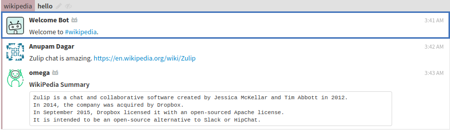
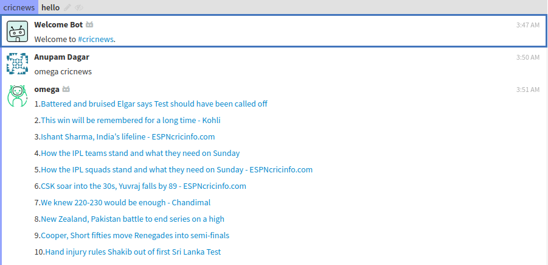

# Welcome to Omega-Bot!
## Team Chunkzz 
  [Website](https://mubaris.github.io/omega_bot/website/)

## **Omega-Bot** is a zulip chatbot   

# Integrations

Google Drive	|	Twitter
:--------------:|:-------------:
			|	

# Instructions to run locally:
1. [Create a Zulip Realm](https://zulip.com/create_realm/)
2. Goto to settings and create a new generic bot named 'omega'. (Settings can be found in dropdown of gear icon present in top right corner of zulip realm)
3. Download the zuliprc file for your bot and place it in your home directory as '.zuliprc'.
  
4. Install all the requirements using ``` pip install -r requirements.txt ```
5. In ``` bot.py ``` , change site in ``` self.client = zulip.Client(site="https://chunkzz.zulipchat.com/api/") ``` to url of your created zulip realm.Do the same for ``` BOT_MAIL ``` variable.  
6. Run ``` bot.py ``` using python 3. ``` python3 bot.py ```
7. Head over to your created zulip realm and start using the bot.

## Setting Up Twitter and Google Drive

### Twitter

create `twitter.ini` inside `omega` folder with the following content.

```
[twitter]
consumer_key=<Consumer Key>
consumer_secret=<Consumer Secret>
access_token=<Access Token>
access_token_secret=<Access Token Secret>
stream=<Private Stream for Tweeting>
```

Twitter integration is meant for organizations to tweet directly from Zulip. It shouldn't be available to everyone, only people who access to the specified Private Stream. Give permissions appropriately!

### Google Drive

Download `client_secrets.json` for Google Drive API and put it in `omega` folder.

`client_secrets.json` should be for Organization Account, not private. So that file will be created in Org account.

# Features

Omega-Bot can :
>
>* Translate any language
>* Get top news from HackerNews
>* Check PNR status
>* Take Screenshots
>* Check Crypto Currency
>* Must-read functionality for channels
>* Crack a joke
>* Motivates you with quotes
>* Shorten URL's
>* Check weather of any location
>* Use Gif while chatting :wink:
>* Create Polls
>* Create memo on the cloud using Google Drive Integration
>* Tweet directly from Zulip
>* Have a nice chat with Omega
>* Stay up to date with summary provided by Wikipedia
>* Get meanings of english vocablury, so that you don't stop while discussing
>* Stay updated with cricket scores

## How to use?

###  Twitter :
Use Twitter directly from zulip.Make new tweets and get recent tweets all just with one line in zulip.  
`omega twitter post "content"` or `omega twitter post_image "image url" "content"`  
  


### Memo using Google Drive:
Create memos stored on cloud storage on the go using our zulip Google Drive Integration.  
`omega memo "filename.extension"`
  

### Wikipedia Summary:
Get a summary of the topic whose link gets messaged in zulip streams.  

Just paste any wikipedia url to get the summary.  
  

###  PNR Status :
Easy way to check your train PNR status without leaving Zulip.  

`omega pnr "pnr number"` 
 

  

###  URL Shortner:
Shorten Url withing Zulip itself.  
```omega shortenurl <url>```  

  

###  Crypto Currency :
Want to know exchange rates of crypto? Now you can check that in Zulip itself.  
`omega crypto bhc in inr` or `omega crypto neo`  

  

###  Translate:
Translate messages received in different languages using out Zulip translate integration.  
`omega translate "any language"` 

  

###  HackerNews:
Get top 10 stories of hackernews in no time in your Zulip server.  
`omega HN`  

    

### Cricket Scores:
Know all about cricket scores without leaving Zulip.  
`omega cricnews`  
  

###  Must Read :  
when we are in a group chat and if we want someone who is not online now to read some important message Must Read will be usefull. what it does is the bot will leave the important message as a private message automatically.  

`omega mustread @username "message"`  

  


###  Motivate:
Motivate is here to help you with motivational quotes when you are down :smile:  

```omega motivate```  

  

###  Weather:
This integration will help you to know the weather of any place you type.   

`omega weather <place>`  


###  Dictionary:
This integration is like a typical dictionary.The source of the dictionary is Oxford so the answers are more reliable and correct.      

`omega define "word"`  


###  Joke:
This integration cracks some really good as well as lame jokes !. 

`omega tell a joke`  


###  Gif Chat :
Missing Gif's present in whatsapp and facebook? We bring the same experience to you in Zulip.  
`omega giphy "keyword"`  

  

###  Poll :
Want to take decision collectively via votes, now it's possible on Zulip with out Polls integration.  
`omega poll create "Number of options" question "place the question here" option "place the options"`  
`omega poll show "id"`  
`omega poll show all`  
`omega poll vote "id" "option"`  
`omega poll delete id`  
`omega poll delete all`  
 

###  Screenshot :
Take a screenshot of any url.
`omega screenshot "url"`  
  

## Contributors
* [Mubaris NK](https://github.com/mubaris)  
* [Anupam Dagar](https://github.com/Anupam-Dagar)  
* [Aswin VB](https://github.com/aswinzz)  
* [Aswanth Koleri](https://github.com/aswanthkoleri)    
